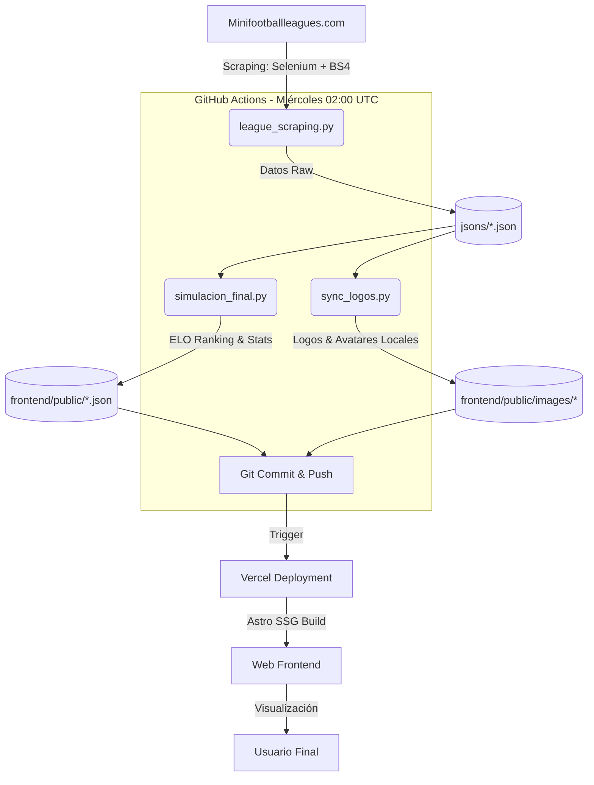

🇪🇸 [Español](README.md) | 🇬🇧 [English](README_EN.md)
---

# ¿Qué es MiniFootballLeagueAnalyzer?

MiniFootballLeagueAnalyzer es una herramienta avanzada de análisis de datos de fútbol aplicada a la MiniFootballLeague de España (https://minifootballleagues.com/). 


Extráe información de las competiciones mediante web scraping y provee infografías útiles que permiten a los equipos estudiar a sus rivales, así como conocer sus propias fortalezas y debilidades.

Las infografías y rankings se actualizan **semanalmente (los miércoles a las 02:00 UTC)** de forma automatizada.

La web cuenta con un menú desplegable para seleccionar la competición deseada. Cada competición incluye:

1. **Power Ranking**: Equipos clasificados por su estado de forma actual y no por puntos oficiales. Este Power Ranking está basado en un sistema ELO similar al que utiliza la FIFA. 
   - **Comparativa Real**: La tabla incluye una comparativa visual con la clasificación oficial.
   - 🟢: El equipo rinde mejor en ELO que en la liga oficial (Infravalorado).
   - 🔴: El equipo rinde peor en ELO que en la liga oficial (Sobrevalorado).
   - 🟰: Coinciden ELO y clasificación real.


2. **Tabla de cuotas**: Probabilidades de los encuentros de la próxima jornada. 

Se incluyen las siguientes competiciones de Fútbol 7:
- Primera División Murcia
- Segunda División A Murcia
- Segunda División B Murcia
- Tercera División A Murcia
- Tercera División B Murcia
- Cuarta División Murcia
- Primera División Granada
- Segunda División Granada
- Liga Veteranos (+35) Granada

3. **Mapa de Sedes**: Localización interactiva (vía Mapbox) de todos los campos de juego de las ligas, incluyendo direcciones exactas y navegación integrada.


La web también dispone de un comparador cara a cara (H2H) al seleccionar dos equipos de una misma competición, mostrando:

- **Tabla de cuotas**: Resultados más probables, porcentajes y Goles Esperados (xG).


- **Evolución ELO**: Gráfica con la progresión de ELO de ambos equipos desde el comienzo de la liga.


- **Gráfico de radar** con las métricas:
  - **Poder Ofensivo**: Capacidad bruta de anotación.
  - **Solidez Defensiva**: Capacidad para evitar goles.
  - **Fair Play**: Nivel de disciplina (mayor puntuación cuantas menos tarjetas).
  - **Reparto del Gol**: Si el porcentaje es cercano al 100%, el equipo no depende de un solo goleador.
  - **Diferencia de Gol**: El balance general de competitividad del equipo.

### Chatbot IA
Integración de un **Chatbot con IA** (potenciado por un modelo de _Google Gemini_) que permite consultar información en tiempo real sobre los equipos y la competición. Se accede a él mediante el botón flotante en la esquina inferior derecha del frontend.


## Instalación y Configuración

Sigue estos pasos para ejecutar el proyecto en tu máquina local.

### 1. Requisitos Previos
- **Python 3.10+**
- **Node.js 18+**
- **Google Chrome** (necesario para el scraping con Selenium)

### 2. Configuración del Entorno (.env)
Este proyecto requiere varias claves de API y configuraciones para funcionar correctamente (Chatbot, Mapas, Supabase).
1. Copia el archivo de ejemplo:
   ```bash
   cp .env.example .env.local
   ```
2. Edita `.env.local` y añade tus propias claves (Gemini, Mapbox, Supabase).

### 3. Backend (Python)
Desde la raíz del proyecto:
```bash
# Crear y activar entorno virtual
python -m venv .venv
source .venv/Scripts/activate  # En Windows: .venv\Scripts\activate

# Instalar dependencias
pip install -r requirements.txt
```

### 4. Frontend (Astro)
Desde la carpeta `frontend/`:
```bash
cd frontend
npm install
npm run dev
```

### 5. Pruebas de Calidad (Testing)

El proyecto utiliza **pytest** para asegurar la integridad de la lógica del sistema ELO y el procesamiento de datos.

1. Ejecuta la suite completa de pruebas unitarias e integración:
   ```bash
   pytest
   ```
   *(Nota: Los tests se encuentran en la carpeta `tests/` e incluyen validaciones del algoritmo ELO y de la estructura de los JSONs).*

2. Para ejecutar las pruebas unitarias e integración del **frontend** (componentes React):
   ```bash
   cd frontend
   npm test
   ```
   *(Nota: Utiliza **Vitest** y **React Testing Library** para validar el Chatbot, el cálculo E2H, la matriz de Poisson y la interfaz de las tablas sin necesidad de abrir el navegador).*

---

## Workflow del Proyecto



### Backend

#### Recolección de Datos
Se utiliza **Python** con **Selenium** y **BeautifulSoup** para recolectar los datos de la web oficial, almacenándolos en archivos JSON dentro de la carpeta `/jsons` para su posterior análisis.

#### Power Ranking (Algoritmo ELO)
Está basado en el sistema ELO tradicional, pero incorpora 2 multiplicadores analíticos específicos:
1. **Margen de Victoria**: Multiplicador de "goleada". Cuanto mayor sea la diferencia de goles en la victoria, más puntos ELO se ganan.
2. **Degradación Temporal (Time-Decay)**: Se otorga mayor peso e importancia a las últimas jornadas disputadas frente a las del inicio de la temporada.

Los JSONs raw (en crudo) son procesados por el algoritmo para exportar un ranking global en el archivo final `elo_rankings.json`.

### Automatización
Todo el ciclo de recolección de datos, descarga de imágenes y actualización de rankings está automatizado y se ejecuta semanalmente (los miércoles a las 02:00 UTC) mediante CI/CD con **GitHub Actions**.


